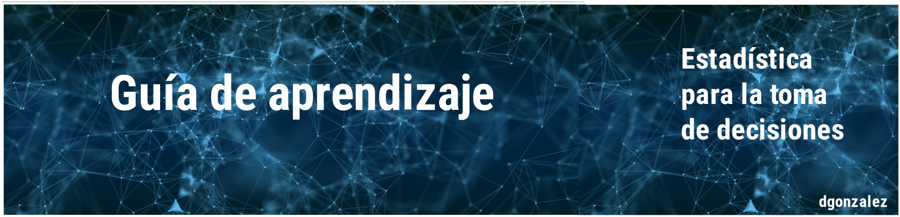

---
title: <span style="color:#FFFFFF"> **Guia 1.1**</span>  
subtitle: <span style="color:#FFFFFF">**Módulo 1- Unidad 1.1**</span> 
output:
  html_document:
    toc: no
    toc_depth: 2
    toc_float: yes
    code_folding: hide
    css: style.css
---    

```{r setup, include=FALSE}
knitr::opts_chunk$set(echo = TRUE, message = FALSE, warning = FALSE, comment = NA)
library(psych)
library(summarytools)

# install.packages("devtools")
#devtools::install_github("dgonxalex80/paqueteDEG")
#library(paqueteDEG)

# colores
c0= "#F7AA00"
c1= "#235784"
c2= "#40A8C4"
c3= "#EEF6F7"

c4= "#11224D"
c5= "#5B84C4"

# install.packages('gtools')
# install.packages("TeachingSampling")

#load library
#library(gtools)
#library(TeachingSampling)
#library(readr)
#base_muestreo <- read_delim("data/base_muestreo.csv", 
#    delim = ";", escape_double = FALSE, col_types = cols(ID = col_integer()), 
#    trim_ws = TRUE)


```

```{r, echo=FALSE, out.width="100%", fig.align = "center"}

```
<br/><br/>


<!-- <span style="color:#db524f"> **EN CONSTRUCCIÓN**</span>  -->

<br/><br/>

## **Introducción**

La representación gráfica de información constituye una de las herramientas mas importantes de la estadística. Con ella podemos observar lo  ocurrido  en  el pasado, el  presente y lo que  podría ocurrir en el futuro y de esta forma orientar nuestras decisiones. 

Es necesario realizar una  correcta visualización de los datos y para ello requerimos seleccionar la gráfica o representación apropiada, conociendo el tipo de variable, su escala de medición y sobre todo lo que queremos resaltar en ella. 

Las gráficas pueden formar parte de un informe en un estudio, para lo cual es necesario conocer los lineamientos exigidos por las normas que los rigen AP, EEE, entre otros. En todos los casos los gráficos deben tener una  enumeración que los permita citar, titulo que permita visualizar lo que están  representando, fuente,  que indique de donde  son extraídos los datos que  la originan. En esta unidad se trataran las diferentes  formas de visualización de datos.

<br/><br/>

## **Objetivos de la unidad**

Al finalizar la unidad los estudiantes estarán  en  capacidad de  RECONOCER los  tipos de gráficos estadísticos y podrán REPRESENTAR e INTERPRETAR  información a  través  de las diferentes formas, que les permita complementar un  análisis de datos estadístico.

<br/><br/>

## **Duración**

La presente  unidad será desarrollada durante la  tercera semana del semestre ( 5 al 11 de febrero). Ademas del material suministrado  contaran con el acompañamiento del profesor en dos  sesiones y una tercera con el acompañamiento del monitor del curso . Los entregables para esta unidad podrán enviarse a través de la plataforma Brightspace hasta el  11 de febrero.

Para alcanzar los objetivos planteados se propone realizar las siguientes actividades

<br/><br/>

## **Cronograma de trabajo**


|Actividad 131   | Descripción                 | 
|:--------------|:-----------------------------|
|Trabajo individual | A partir de la base de datos trabajada en las dos unidades anteriores adiciones los gráficos de las variables contenidas  en la base de datos seleccionada.  En cada caso realice una descripción con los gráficos. |
|Fecha  | 11 de febrero de 2023 |
|Hora   | 23:59 hora local |

<br/><br/>

## **Criterios de evaluación**

+ Reconocer los principales elementos de un  análisis descriptivo de datos y su incidencia en la toma de decisiones.

+ Reconocer e identificar los diferentes tipos de representaciones gráficas y sus respectivas interpretación.

+ Utilizar herramientas computacionales para el procesamiento de la información.

<br/><br/>

## **Entregable** 


| Entregable    | Descripción                   | 
|:--------------|:------------------------------|
| Actividad131  | enlace de  documento publicado RPlub  |
| Fecha         | 11 de febrer0 de 2024             |
|Hora límite    | 23:59  hora  local            |


<br/><br/><br/><br/>


