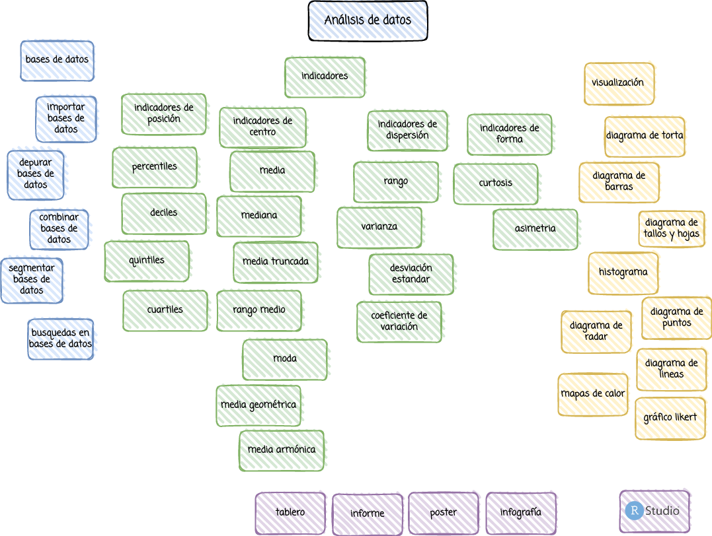

```{r setup, include=FALSE}
knitr::opts_chunk$set(echo = TRUE, comment = NA)
```

<br/><br/>

# **Introducción**

Este primer módulo te permitirá recorrer los  pasos de la metodología estadística  y realizar un análisis descriptivos de tus datos, empleando para ellos software estadístico y diversas bases de datos disponibles en internet.  Para lograrlo se plantean tres unidades : Bases de datos, Tablas de frecuencia e indicadores descriptivos y por último la representación  gráfica o visualización de  datos.  Requiere revisar los conceptos de sumatoria  y productoria contenidos en  el Modulo 0

<br/><br/>

# **Objetivo**

Al finalizar este módulo el estudiante estará en capacidad de RESUMIR e INTERPRETAR información mediante la construcción de TABLAS DE FRECUENCIA, INDICADORES DESCRIPTIVOS Y GRAFICOS para la interpretación  y construcción de informes estadísticos descriptivos 

<br/><br/>

# **Conenido** 

* Conceptos básicos. Pasos de la metodología estadística, diferencia un estudio descriptivo de uno inferencial. 

* Análisis univariado: Resumen de información estadística a través de tablas, gráficos de frecuencia, indicadores de tendencia central, dispersión y posición.

* Análisis bivariado: Análisis de información cruzada, frecuencias marginales, conjuntas y condicionales.  Análisis de la relación lineal entre variables cuantitativas. Gráficos de dispersión. Coeficiente de correlación lineal

# **Mapa**



