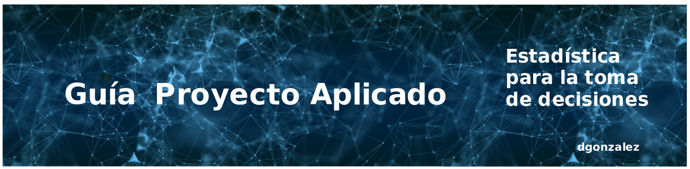

---
title: <span style="color:#235784"> **Guía Proyecto**</span>  
subtitle: <span style="color:#235784">**Estadística para la toma de decisiones**</span> 
author: "dgonzalez "
output:
   html_document:
      toc: no
      toc_depth: 2
      toc_float: yes
      code_folding: hide
      css: style.css
    

--- 

```{r setup, include=FALSE}
knitr::opts_chunk$set(echo = TRUE, comment = NA)
# colores
c0= "#b0394a"
c1= "#ad6395"
c2= "#a391c4"
c3= "#8acfe6"
c4= "#646420"
c5= "#db524f"
```

<br/><br/><br/>

```{r, echo=FALSE, out.width="100%", fig.align = "center"}

```


<br/><br/>

Los estudiantes deberán realizar un proyecto que les permita poner en práctica los conocimientos adquiridos en el curso de  Estadística para la toma de decisiones.

<br/><br/><br/>
  
## **Objetivos** 
  
+ Contribuir a la formación integral, al trabajo en equipo y la interrelación de conocimientos de Estadística alrededor de un problema específico.

+ Permitir a los  estudiantes detectar situaciones en las cuales pueda aplicar las técnicas Estadísticas estudiadas.

+ Desarrollar destrezas en el análisis estadístico y la presentación de informes estadísticos. 

<br/><br/><br/>
  
## **Temática** 
  
En **equipos** de hasta tres estudiantes deberán desarrollar un trabajo que corresponda a un problema de  interés para el  grupo, que permita la aplicación de la Estadística en un tema específico. 

El producto de este trabajo deberá ser entregado en formato  **poster** $A1$ (Ancho: 594 mm, Alto: 841 mm) impreso y en formato pdf  y ser presentado por los integrantes del grupo, contando de un tiempo de 10 minutos para ello.

<br/><br/><br/>
  
## **Requisitos** 
  
+ Equipos debe ser conformado por hasta  tres  estudiantes. No se permiten trabajos individuales.

+ Seleccionar un problema de interés propio para el grupo que  permita la aplicación de los conocimientos de estadística vistos en el curso. El tema propuesto deberá contar con el visto bueno del profesor.

+  El contenido del **poster** deberá utilizar las técnicas estadísticas trabajadas en el curso.

+ Al final los estudiantes deberán realizar una presentación del trabajo y de los principales hallazgos.

+ Contenido del poster
    + Titulo
    + Integrantes
    + Introducción
    + Metodología
    + Resultados
    + Conclusiones y recomendaciones
    + Bibliografia

<br/><br/><br/>
  
## **Entregas** 

  <br/>
  
### **Primera Entrega : Informe parcial** (5%)

Documento en formato pdf que contenga la propuesta seleccionada (problema) 
    
* Titulo
    
* objetivos
    
* Metodología

  * Fecha :  abril 12 de 2024
  * Hora : 23:59
  
<br/><br/>  

### **Entrega del informe final y presentación oral por parte del equipo:** (15%)

* **Poster** en formato impreso  

* Fecha :  mayo 17 de 2024

* Espacio : última sesión de clases

* El presentador del poster será sorteado en el momento de la entrega

<br/><br/><br/>
  
## **Referencias** 
  
  <br/>
  
+ Metodología de la investigación . Hernandez Sampieri Roberto. Segunda edición. Mc Graw-Hill
+ Investigación de Mercados. Naresh K. Malhotra. Quinta Edición. Pearson.
+ [Poster en overleaf](https://www.overleaf.com/learn/latex/Posters) : plataforma con formatos TeX y posibilidad de trabajo grupal en linea
+ [trello- tablero para la gestión de proyectos](https://trello.com/es/tour) : Metodogía Kamban (tablero Kamban)

<br/><br/>


## **Nota**

El proyecto se puede basar en los datos contenidos en las plataformas de bases de datos abiertos como:

* [**Datos abiertos Colombia**](https://www.datos.gov.co/)
* [**kaggle**](https://www.kaggle.com/)


<br/><br/><br/><br/>

# Conformación de los grupos

<br/><br/>

### Grupo 1    
  
  * Isabel Cristina Palau
  * Daniel Esguerra
  * Darwin Gomez 

Tema:  

<br/><br/>

### Grupo 2
  
  * Ashley Coral
  * Santiago Castañeda

Tema:  

<br/><br/>

### Grupo 3
  
  * Laura Marcela Bedoya
  * Marcelo Mejia

Tema:  

<br/><br/>

### Grupo 4
  * Laura Giraldo
  * Samuel Montoya     

Tema:

<br/><br/>

### Grupo 5
  
  * Jose Miguel Gutierrez
  * Gabriela Penenori       

Tema:  

<br/><br/>

### Grupo 6
  
  * Leydi Henao
  * Raúl Rodriguez

Tema:

<br/><br/>

### Grupo 7 

* Micolas Solarte
* Juan Andres Trujillo
* Rudolph Verhest

Tema:
