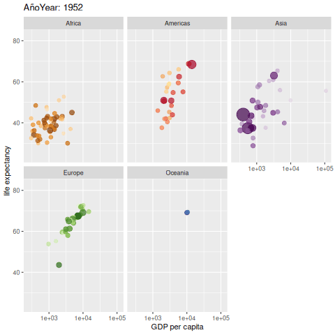

---
title: <span style="color:#235784"> **Recursos 1.4**</span>  
author: "dgonzalez "
subtitle: <span style="color:#235784">**Módulo 1- Unidad 1.4**</span> 
output:
  html_document:
    toc: no
    toc_depth: 2
    toc_float: yes
    code_folding: hide
    css: style.css
---    

```{r setup, include=FALSE}
knitr::opts_chunk$set(echo = TRUE, message = FALSE, warning = FALSE, comment = NA)
library(psych)
library(summarytools)

# install.packages("devtools")
#devtools::install_github("dgonxalex80/paqueteDEG")
#library(paqueteDEG)

# colores
c0= "#F7AA00"
c1= "#235784"
c2= "#40A8C4"
c3= "#EEF6F7"

c4= "#11224D"
c5= "#5B84C4"

# install.packages('gtools')
# install.packages("TeachingSampling")

#load library
#library(gtools)
#library(TeachingSampling)
#library(readr)
#base_muestreo <- read_delim("data/base_muestreo.csv", 
#    delim = ";", escape_double = FALSE, col_types = cols(ID = col_integer()), 
#    trim_ws = TRUE)


```

<br/><br/>

## **Introducción**

>Una gráfica o una representación gráfica o un gráfico, es un tipo de representación de datos, generalmente cuantitativos, mediante recursos visuales (líneas, vectores, superficies o símbolos), para que se manifieste visualmente la relación matemática o correlación estadística que guardan entre sí.

Wikipedia

<br/><br/>

La representación gráfica desempeña un papel fundamental en el análisis estadístico al proporcionar una visualización intuitiva y accesible de conjuntos de datos complejos. Las gráficas permiten identificar patrones, tendencias y relaciones entre variables de manera rápida y efectiva, facilitando la interpretación de la información estadística. Además, ofrecen una herramienta poderosa para comunicar resultados de manera clara y comprensible tanto a expertos como a personas no familiarizadas con la estadística. La visualización gráfica no solo simplifica la presentación de datos, sino que también ayuda a detectar valores atípicos, entender la distribución de los datos y respaldar la toma de decisiones informadas. 


Elegir el gráfico adecuado es muy importante pues existen diferentes alternativos  y se debe escoger el apropiado para representar los datos. El tipo de dato determina el tipo de grafico asi:

<br/><br/>

|Tipo de variable  | Escala          | Gráfico                                   |
|:-----------------|:----------------|:------------------------------------------|
|Cualitativas      |                 |                                           |
|                  |Nominal          | torta                                     |
|                  |Ordinal          | barras                                    |
|Cuantitativas     |Intervalo-razón  | diagrama de tallos y hojas                |
|                  |                 | histograma                                |
|                  |                 | diagrama de cajas                         |
|                  |                 | diagrama de densidad                      |
|                  |                 | diagrama de puntos                        |
|                  |                 | diagrama de lineas                        |
|                  |                 | diagrama de radar                         |
|                  |                 | gráfico likert                            |
|                  |                 | mapa de calor                             |
|                  |                 |                                           |


<br/><br/>

## **Paquetes de R para gráficos**

R posee una serie de paquetes construido para la visualización de datos que hacen que tengan una excelente presentación. Empezando por funciones del núcleo base, hasta paquetes que elaboran gráficos interactivos


 


<br/><br/>

### **Gráficos variables cualitativas con R base**


Las variables cualitativas se pueden representar gráficamente de diversas maneras. Aquí te mencionaré algunas opciones comunes dependiendo del tipo de variable cualitativa:

Es esencial elegir la representación gráfica adecuada según la naturaleza de los datos y los objetivos específicos del análisis. Además, la claridad en las etiquetas, el uso de colores significativos y la legibilidad son factores importantes en cualquier representación gráfica.

<br/><br/>

### **Gráfico de tortas**

Los diagramas de torta, también conocidos como gráficos circulares o gráficos de sectores, son una forma efectiva de representar proporciones y porcentajes en un conjunto de datos categóricos. Este tipo de gráfico utiliza un círculo dividido en sectores, donde cada sector representa una categoría específica y el tamaño angular del sector es proporcional a la frecuencia o porcentaje que esa categoría representa con respecto al total.

La principal ventaja de los diagramas de torta es su capacidad para visualizar fácilmente la contribución relativa de cada categoría al conjunto total. Esto facilita la comparación de las proporciones entre diferentes categorías y proporciona una representación visual intuitiva de la distribución de los datos.

Al interpretar un diagrama de torta, es esencial que la suma de los ángulos de todos los sectores sea igual a 360 grados, ya que representa la totalidad del conjunto de datos. Además, es recomendable limitar el número de categorías para evitar la congestión visual y garantizar la legibilidad del gráfico.

Es importante destacar que, aunque los diagramas de torta son útiles para representar proporciones, a veces otros tipos de gráficos, como los diagramas de barras o los gráficos de líneas, pueden ser más apropiados para ciertos conjuntos de datos, especialmente cuando se busca resaltar diferencias más sutiles entre categorías o mostrar datos numéricos con mayor precisión.

<br/><br/>

```{r, fig.height=6}
paleta4=c("#0d3b66", "#faf0ca", "#f4d35e", "#ee964d")
a=rep("Cultutal", 360145)
b=rep("Pastoral", 61496)
c=rep("Bienestar",49912)
d=rep("Deportivo",11777)
data=c(a,b,c,d)
t=table(data)
lbs=c("Cultural", "Pastoral", "Bienestar", "Deportivo")
pct=round(t/sum(t)*100)
labs=paste(lbs, pct)
labs=paste(labs, "%", sep = " ") 
pie(t, labels=labs, main=" Participación eventos Medio Universitario",
    col = paleta4)
```

<br/><br/>

## **Diagrama de barras**

Los diagramas de barras son una representación gráfica efectiva para variables cualitativas o categóricas en escala ordinal. Estos gráficos muestran la frecuencia o proporción de diferentes categorías, utilizando barras rectangulares que se extienden a lo largo de un eje.
**Pasos para crear un diagrama de barras:**

En su construcción es necesario :

* **Identificar las categorías:** Define las categorías de la variable cualitativa que deseas representar en el eje horizontal (eje x).

* **Determinar las frecuencia o proporción:** Para cada categoría, determina la frecuencia (número de observaciones) o la proporción que representa con respecto al total. Este proceso se logra construyendo una tabla de frecuencias de la variable.

* **Eje Vertical (eje y):** En el eje vertical, representa la frecuencia o proporción de cada categoría utilizando barras. La altura de cada barra indica la magnitud de la frecuencia o proporción. En ocaciones es posible tambien hacerlo de forma horizontal de tal forma que las barras quedan de forma horizontal.

* **Espacio entre Barras:** se deja un espacio uniforme entre las barras para evitar la confusión visual y garantizar una presentación clara. Esto obedece a que las categorías deben estar representadas por puntos separados y no de forma continua.

* **Etiquetar y colocar el título:** Etiqueta cada eje adecuadamente, proporciona información clara sobre las unidades y agrega un título que resuma la naturaleza del diagrama.

* **Dar Comparación Visual:** Observa la longitud de las barras para comparar la magnitud de las frecuencias o proporciones entre las diferentes categorías. Es decir dar una buena escala a las dimensiones de la gráfica
  
* **Dar orden a las categorías:** En el caso de variables ordinales, las barras deben seguir el orden lógico de las categorías. `Regular < Bueno < Excelente`.  Es posible que algunos programas de orden a las categorías alfabeticamente.

* **Selección del color y el diseño:** Puedes utilizar colores para resaltar categorías específicas o para mejorar la estética del gráfico. Se recomienda utilizar una paleta de colores predefinida.

Los diagramas de barras son versátiles y se pueden adaptar a diferentes tipos de datos cualitativos. Ya sea un gráfico de barras agrupadas, apiladas o en forma de histograma, proporcionan una representación visual clara y accesible de la distribución de las categorías en tus datos.

<br/><br/>

```{r, fig.height=6}
ev=c(4,  8, 12, 43, 32)
names(ev)=c("Muy regular", "Regular", "Bueno", "Muy bueno","Excelente")
barplot(ev, col=c("#ff5b00","#dcf600","#7dbd00","#659cef","#2956b2"), main = "Evaluación proceso de inducción")
```

### **Diagrama de barras dos variables**

```{r, fig.height=5.5}
counts <- table(mtcars$vs, mtcars$gear); rownames(counts)=c("Montor en linea", "Motor en V")
barplot(counts, main="Numero de cambios adelante por Tipo de motor",  xlab="Numero de cambios adelante ",col=c("#447270","#f6e271"),
  legend = rownames(counts))
```

<br/><br/>


### **Gráficas variables cuantitativas con R base**

Para el caso de las variables numéricas se presentan varias opciones que por lo general resaltan las caracteristicas de los datos - centro, dispersión y forma. Adicionalmente destacan su  mínimo y su máximo.

<br/><br/>

### **Diagrama de tallos y hojas**

Este diagrama permite ordenar los datos de menor a mayor y tiene como principio que todos los números que conforman se pueden partir en dos partes. La primera parte llanada tallo es comú a muchos números y la segunda parte llamada hoja varia entre 0 y 9. Estas dos partes estan separadas por una linea.


```{r}
nf=c(4.1, 2.7, 3.1, 3.2, 3.0, 3.2, 2.0, 2.4, 1.6, 3.2, 3.1, 2.6, 2.0, 2.4, 2.8, 3.3, 4.0, 3.4, 3.0, 3.1, 2.7, 2.7, 3.0, 3.8, 3.2, 2.2, 3.5, 3.5, 3.8, 3.5, 3.9, 4.2, 4.3, 3.9, 3.2, 3.5, 3.5, 3.7, 4.1, 3.7, 3.5, 3.6, 3.2, 3.1, 3.4, 3.0, 3.0, 3.0, 2.7, 1.7, 3.6, 2.1, 2.4, 3.0, 3.1, 2.5, 2.5, 3.6, 2.2, 2.4, 3.1, 3.3, 2.7, 3.7, 3.0, 2.7, 3.0, 3.2, 3.1, 2.4, 3.0, 2.7, 2.5, 3.0, 3.0, 3.0, 3.2, 3.1, 3.8, 4.1, 3.7, 3.5, 3.0, 3.7, 3.7, 4.1, 3.7, 3.9, 3.7, 2.0)
stem(nf)
```
Este diagrama ordena los datos de manera que se puede determinar tanto en mínimo (1.6) como el máximo (4.3) , además de visualizar donde están la mayor concentración de ellos.

<br/><br/>

### **Histograma**


Los histogramas son gráficas esenciales para representar la distribución de variables numéricas. Este tipo de gráfico organiza los datos en intervalos, denominados "bins", en el eje horizontal, mientras que en el eje vertical se representa la frecuencia o densidad de ocurrencia de observaciones dentro de cada intervalo. Cada rectangulo en el histograma refleja la cantidad de datos que caen dentro de un rango específico de valores, brindando una visualización clara de la forma y la dispersión de la distribución.

La construcción de un histograma implica seleccionar un número adecuado de bins para dividir el rango de datos y calcular la frecuencia de observaciones en cada bin. Este gráfico es especialmente útil para identificar patrones, sesgos, modas y características clave de la distribución de datos. Además, los histogramas permiten visualizar la simetría, la dispersión y la centralidad de la variable numérica, facilitando así la interpretación y el análisis exploratorio de datos. 


```{r, fig.height=5}
h1=hist(nf, main = "Nota final matemáticas fundamentales", xlab = "nota", ylab="frecuencias absolutas", labels=TRUE, col="#6b9493", ylim = c(0,30))
abline(v=3,col="#f6b915", lwd=4)
```


<br/><br/>

### **Diagrama de densidad**

Un diagrama de densidad es una representación gráfica que muestra la distribución de una variable numérica de manera continua. Este tipo de gráfico es una forma suavizada de un histograma y proporciona información detallada sobre la forma de la distribución de datos, resaltando áreas de concentración y variabilidad. 

El diagrama de densidad es una representación visual que permite explorar la distribución de una variable numérica de manera más suave y continua que un histograma. Se construye trazando una curva suavizada a lo largo del rango de valores de la variable. Esta curva representa la estimación de la densidad de probabilidad de los datos, indicando las áreas donde la concentración de observaciones es mayor o menor.


```{r, fig.height=5}
nf=c(4.1, 2.7, 3.1, 3.2, 3.0, 3.2, 2.0, 2.4, 1.6, 3.2, 3.1, 2.6, 2.0, 2.4, 2.8, 3.3, 4.0, 3.4, 3.0, 3.1, 2.7, 2.7, 3.0, 3.8, 3.2, 2.2, 3.5, 3.5, 3.8, 3.5, 3.9, 4.2, 4.3, 3.9, 3.2, 3.5, 3.5, 3.7, 4.1, 3.7, 3.5, 3.6, 3.2, 3.1, 3.4, 3.0, 3.0, 3.0, 2.7, 1.7, 3.6, 2.1, 2.4, 3.0, 3.1, 2.5, 2.5, 3.6, 2.2, 2.4, 3.1, 3.3, 2.7, 3.7, 3.0, 2.7, 3.0, 3.2, 3.1, 2.4, 3.0, 2.7, 2.5, 3.0, 3.0, 3.0, 3.2, 3.1, 3.8, 4.1, 3.7, 3.5, 3.0, 3.7, 3.7, 4.1, 3.7, 3.9, 3.7, 2.0)
plot(density(nf), main="Distribucion de las notas de matematias fundamentales", col=c0, lwd=4)
```

<br/><br/>
  
### **Diagrama de cajas**


Un diagrama de caja, también conocido como boxplot, es una herramienta gráfica que proporciona una representación visual de la distribución estadística de un conjunto de datos numéricos. Este gráfico es particularmente útil para identificar medidas centrales, dispersión, y posibles valores atípicos en un conjunto de datos. Aquí hay una explicación sobre los diagramas de caja:

Un diagrama de caja consta de un rectángulo (la "caja") que representa el rango intercuartílico (`IQR`), que es la diferencia entre el tercer cuartil (`Q3`) y el primer cuartil (`Q1`). Dentro de la caja, una línea vertical (la "mediana") indica la posición de la mediana del conjunto de datos. Dos líneas (los "bigotes") se extienden desde la caja hasta los valores extremos dentro de un rango específico, generalmente calculado como 1.5 veces el IQR. Puntos fuera de este rango se consideran valores atípicos y se representan individualmente.

El diagrama de caja es valioso para identificar la dispersión y la simetría de los datos, así como para destacar posibles valores atípicos. También facilita la comparación visual de varias distribuciones. Los diagramas de caja son particularmente útiles cuando se trabaja con conjuntos de datos grandes o cuando se desea realizar una evaluación rápida de la variabilidad y la forma de la distribución.


```{r}
nf=c(4.1, 2.7, 3.1, 3.2, 3.0, 3.2, 2.0, 2.4, 1.6, 3.2, 3.1, 2.6, 2.0, 2.4, 2.8, 3.3, 4.0, 3.4, 3.0, 3.1, 2.7, 2.7, 3.0, 3.8, 3.2, 2.2, 3.5, 3.5, 3.8, 3.5, 3.9, 4.2, 4.3, 3.9, 3.2, 3.5, 3.5, 3.7, 4.1, 3.7, 3.5, 3.6, 3.2, 3.1, 3.4, 3.0, 3.0, 3.0, 2.7, 1.7, 3.6, 2.1, 2.4, 3.0, 3.1, 2.5, 2.5, 3.6, 2.2, 2.4, 3.1, 3.3, 2.7, 3.7, 3.0, 2.7, 3.0, 3.2, 3.1, 2.4, 3.0, 2.7, 2.5, 3.0, 3.0, 3.0, 3.2, 3.1, 3.8, 4.1, 3.7, 3.5, 3.0, 3.7, 3.7, 4.1, 3.7, 3.9, 3.7, 2.0)
boxplot(nf, main="Nota final matemáticas fundamentales",col="#6abce2", las=1)
abline(h=3, col="red")
```
  
<br/><br/>

### **Diagrama de cajas por grupos**

Este tipo de gráficos permite la comparación de más de dos grupos en un mismo gráfico, permitiendo comparar su centro, dispersión y forma.


```{r, fig.height=4.5}
nf=c(4.1, 2.7, 3.1, 3.2, 3.0, 3.2, 2.0, 2.4, 1.6, 3.2, 3.1, 2.6, 2.0, 2.4, 2.8, 3.3, 4.0, 3.4, 3.0, 3.1, 2.7, 2.7, 3.0, 3.8, 3.2, 2.2, 3.5, 3.5, 3.8, 3.5, 3.9, 4.2, 4.3, 3.9, 3.2, 3.5, 3.5, 3.7, 4.1, 3.7, 3.5, 3.6, 3.2, 3.1, 3.4, 3.0, 3.0, 3.0, 2.7, 1.7, 3.6, 2.1, 2.4, 3.0, 3.1, 2.5, 2.5, 3.6, 2.2, 2.4, 3.1, 3.3, 2.7, 3.7, 3.0, 2.7, 3.0, 3.2, 3.1, 2.4, 3.0, 2.7, 2.5, 3.0, 3.0, 3.0, 3.2, 3.1, 3.8, 4.1, 3.7, 3.5, 3.0, 3.7, 3.7, 4.1, 3.7, 3.9, 3.7, 2.0)
cc=c(20, 10, 20, 20, 20, 20, 20, 20, 20, 30, 20, 20, 20, 10, 30, 20, 20, 30, 20, 30, 30, 20, 10, 30, 20, 20, 30, 30, 10, 20, 10, 20, 20, 20, 10, 20, 10, 20, 20, 30, 30, 30, 10, 30, 20, 20, 20, 20, 20, 20, 10, 20, 30, 30, 10, 10, 10, 20, 10, 20, 10, 30, 20, 10, 20, 30, 10, 30, 30, 30, 20, 30, 30, 30, 30, 30, 30, 20, 10, 30, 10, 20, 20, 10, 20, 20, 20, 20, 10, 20)
labs=c("Ing. de Sistemas","Ing. Industrial","Ing. Mecánica")
boxplot((nf~cc),main="Nota final matemáticas fundamentales por carrera", 
        col=c("#066d8d","#34b5aa","#ecbe14"), names=labs, xlab = "carrera", ylab = "nota")
abline(h=3, col="#f69312", lwd=4)
abline(h=4, col="#447270", lwd=4)
```

<br/><br/>

### **Diagrama de dispersión**


Un diagrama de dispersión es una representación gráfica que muestra la relación entre dos variables numéricas. Este tipo de gráfico es útil para visualizar patrones, tendencias y la fuerza de la relación entre dos conjuntos de datos. A continuación, se proporciona una explicación sobre los diagramas de dispersión:

El diagrama de dispersión representa puntos de datos en un plano cartesiano, donde cada punto refleja los valores de ambas variables. El eje horizontal generalmente representa una variable, mientras que el eje vertical representa la otra. Cada punto en el gráfico representa una observación y su posición en el plano está determinada por sus valores en ambas variables.

La interpretación de un diagrama de dispersión permite identificar patrones generales, relaciones lineales o no lineales, concentraciones de datos y la presencia de valores atípicos. Además, la dirección de la relación (positiva, negativa o nula) puede evaluarse visualmente. Si los puntos se agrupan en una tendencia ascendente, indica una relación positiva; si la tendencia es descendente, la relación es negativa; y si no hay tendencia clara, la relación puede considerarse nula.

Los diagramas de dispersión son valiosos para explorar y entender las relaciones entre variables, lo que puede ser crucial en el análisis de datos y la toma de decisiones. También son fundamentales para el análisis de regresión, donde se busca modelar y predecir la relación entre variables. En resumen, los diagramas de dispersión son herramientas visuales esenciales que proporcionan una visión clara y rápida de la relación entre dos variables numéricas.


```{r, fig.height=5}
ed=round(rnorm(90,18,1),1)
plot(ed,nf, main="Edad vs Nota final matemáticas fundamentales", ylim = c(0,5), xlab = "Edad", ylab = "Nota final",col="#447270",pch=19)
grid()
```


<br/><br/>

### **Gráfica de lineas**

Los gráficos de líneas son herramientas efectivas para visualizar series de tiempo, ya que permiten representar de manera clara y continua la evolución de una variable a lo largo del tiempo. Aquí hay una explicación sobre cómo se utilizan los gráficos de líneas para representar series de tiempo:

Un gráfico de líneas para series de tiempo se construye colocando el tiempo en el eje horizontal (`eje x`) y la variable que se está observando en el eje vertical (`eje y`). Cada punto en el gráfico representa una observación en un momento específico, y las líneas conectan estos puntos de manera secuencial, creando una representación visual de cómo cambia la variable a lo largo del tiempo.

Este tipo de gráfico es especialmente útil para identificar patrones, tendencias y ciclos en los datos a lo largo de períodos temporales. Puede utilizarse para visualizar el crecimiento o la disminución de una variable a lo largo del tiempo, así como para identificar puntos destacados o anomalías.

Algunas características clave de los gráficos de líneas para series de tiempo incluyen:

* **Tendencias Temporales:** La dirección general del gráfico puede indicar una tendencia ascendente, descendente o estable.

* **Ciclos y Estacionalidad:** Se pueden identificar patrones cíclicos o estacionales en los datos.

* **Cambios Significativos:** Anomalías o puntos de cambio en la serie de tiempo pueden ser evidentes.

* **Comparación de Múltiples Series:** Se pueden comparar varias series de tiempo en un solo gráfico para observar relaciones o diferencias.

Estos gráficos son fundamentales en áreas como la economía, finanzas, climatología y otras disciplinas donde el tiempo es una dimensión crítica en el análisis de datos. La representación visual de las series temporales facilita la comprensión de patrones a lo largo del tiempo y ayuda en la toma de decisiones informadas.


```{r, fig.height=5}
plot(AirPassengers, main="Numero de pasajeros por mes", col="#203c3b", lwd = 4)
```

<br/><br/>

### **Resumen**

```{r, eval=FALSE}
x=rnorm(100,100,20)
y=rnorm(100,100,25)
z=rbinom(100,4,0.30)
t=1:100
par(mfrow=c(2, 2))
pie(table(z))
barplot(table(z))
stem(x)
hist(x)
boxplot(x)
plot(x,y)
plot(t,y, type="l")
plot(density(x))
par(mfrow=c(1, 1))
```
    

<br/><br/>


## **Gráficos con ggplot2**

`ggplot2` es una librería en R utilizada para la creación de gráficos de alta calidad y versátiles. Desarrollada por Hadley Wickham, `ggplot2` se basa en el concepto de "Grammar of Graphics", lo que facilita la creación de gráficos complejos mediante la combinación de capas.

Aquí hay un ejemplo básico utilizando `ggplot2` para crear un gráfico de líneas para una serie de tiempo:

```{r}
# Instalar y cargar la librería ggplot2
# install.packages("ggplot2")
library(ggplot2)

# Crear un conjunto de datos de ejemplo
set.seed(123)
datos <- data.frame(
  tiempo = seq(as.Date("2022-01-01"), by = "1 day", length.out = 365),
  variable = cumsum(rnorm(365))
)

# Crear un gráfico de líneas utilizando ggplot2
ggplot(data = datos, aes(x = tiempo, y = variable)) +
  geom_line() +
  labs(title = "Gráfico de Líneas para una Serie de Tiempo",
       x = "Tiempo",
       y = "Variable")
```

En este ejemplo:

1. **Datos de ejemplo:** Se crea un conjunto de datos con una variable que simula una serie de tiempo a lo largo de un año.

2. **Función `ggplot`:** Inicia la construcción del gráfico, especificando los datos y las variables estéticas (`aes`).

3. **`geom_line()`:** Agrega una capa al gráfico para representar líneas, lo que crea el gráfico de líneas.

4. **`labs()`:** Agrega etiquetas al título y ejes del gráfico.

Este es solo un ejemplo básico; `ggplot2` ofrece muchas opciones para personalizar y ampliar gráficos, como agregar capas adicionales, cambiar colores, temas y más. Es una herramienta poderosa para la visualización de datos en R.

<br/><br/>

En `ggplot2`, la creación de gráficos se basa en el concepto de añadir capas (layers) de información al gráfico. Cada capa agrega un componente específico al gráfico y te permite construir visualizaciones complejas y detalladas. Aquí hay una explicación de las capas comunes en un gráfico construido con `ggplot2`:

* **Datos (`ggplot()`):** La función `ggplot()` inicializa el gráfico y define los datos que se utilizarán. Se especifican las variables estéticas (a través del argumento `aes`) que serán mapeadas a ejes x, y, colores, formas, etc.

</br></br>

* **Capa inicial**

```{r,fig.height=5}
library(readr)
library(ggplot2)
clasificacion=read.csv("data/spi_global_rankings_intl.csv")

p <-ggplot(clasificacion, aes(x=off , y=def))
p
```

</br></br>

* **Capa de Geometría (`geom_`):** La capa de geometría determina la forma principal del gráfico. Puedes utilizar funciones como `geom_point()`, `geom_line()`, `geom_bar()`, etc., para especificar cómo se representarán los datos.


```{r,fig.height=5}
p <- p + geom_point()
p
```

</br></br>

* **Capa de Anotaciones (`geom_text()`, `geom_label()`, etc.):** Puedes añadir capas adicionales para etiquetas o textos específicos en el gráfico. Estas capas permiten resaltar puntos clave o añadir información adicional.

```{r}
p <- p  + geom_text(aes(label = "*"), x = 2, y = 4)
p
```

</br></br>

|                   |                    |                     |                      |
|:------------------|:-------------------|:--------------------|:---------------------|
|geo_point()        |geom_bar()          |geom_col()           |stat_count()          |
|geom_boxplot()     |stat_boxplot()      |geom_density()       |stat_density()        |
|geom_histogram()   |geom_violin()       |                     |                      |


* **Capa de Escala (`scale_`):** Las capas de escala controlan cómo se mapean los datos a atributos visuales, como colores o tamaños. Puedes utilizar funciones como `scale_x_continuous()`, `scale_color_gradient()`, etc.

</br></br>


```{r}
library(ggplot2)

# Suponiendo que "clasificacion" es tu conjunto de datos
# Puedes ajustar estos valores según tus necesidades

p <- p+ scale_x_continuous(name = "Puntuación Ofensiva", 
                           breaks = seq(0, 4, by = 10), limits = c(0, 4)) +           
        scale_y_continuous(name = "Puntuación Defensiva", 
                           breaks = seq(0, 7, by = 10), limits = c(0, 7))            
p  

```

</br></br>


*  **Capa de Facetas (`facet_`):** Las capas de facetas permiten dividir el gráfico en subgráficos basados en una variable categórica. Esto es útil para comparar visualmente la distribución de datos en diferentes grupos.

```{r, message=FALSE, warning=FALSE,fig.height=5}

p <- p +facet_wrap(~ confed)
p

```

</br></br>

*  **Capa de Tema (`theme_`):** Controla la apariencia general del gráfico, como títulos, etiquetas de ejes, colores de fondo, etc.

```{r}
p + theme_minimal()
```

Estas son solo algunas de las capas más comunes. La flexibilidad de `ggplot2` permite añadir capas adicionales o personalizar cada capa para crear gráficos altamente informativos y estéticamente agradables. La construcción del gráfico se realiza acumulando estas capas una encima de la otra mediante el operador `+`.


</br></br>

### **Resumen ggplot2**


+ **Data**: capa de los datos

+ **Aesthetics**: capa estética (**aes**), definimos las variables a utilizar en el gráfico

+ **Geometries**: capa de geometrías, se define el tipo de gráfica a realizar

+ **Facets**: capa de facetas, permite detallar la gráfica por categorías

+ **Statistics**: capa de estadística, permite agregar modelos

+ **Coordinates**: capa de coordenadas, permite ajustar las escalas de los ejes

+ **Theme**: capas de características del gráfico que no dependen de  los datos


</br></br>

### **EJEMPLOS**

</br></br>

```{r, message=FALSE, warning=FALSE,fig.height=5}
ggplot(clasificacion, aes(x=off , y=def))+  geom_point()+  facet_wrap(~ confed)+ stat_smooth(method = "loess" , formula =y ~ x)+
  	coord_cartesian(ylim = c(0, 10))
```

</br></br>


```{r, fig.height=5}
library(ggplot2)
data=data.frame(carrera=c("biologia","biomedica","civil","electronica","mecanica",  "sistemas"),frecuencia=c(8, 9,10,2, 3,7))

ggplot(data, aes(x=carrera, y=frecuencia)) +
  geom_bar(stat="identity", fill="#203c3d")+
  geom_text(aes(label=frecuencia), vjust=2.5, color="white", size=7)+
  theme_minimal()
```

</br></br>

```{r, message=FALSE, warning=FALSE,fig.height=5}
library(ggplot2)
ggplot(mtcars, aes(x=mpg, y=wt, colour = cyl)) + 
  geom_point()

```

</br></br>

```{r, message=FALSE, warning=FALSE,fig.height=5}
ggplot(iris, aes(Sepal.Length)) +
       geom_histogram(bins = 7,fill="#447270", color="#e9ecef", alpha=0.9)+
       theme_minimal() +
       labs(x = "cm", y = "frecuencia absoluta") +
       ggtitle("Longitud del sepalo")


```

</br></br>

```{r, message=FALSE, warning=FALSE, fig.height=4}
ggplot(iris, aes(x=Sepal.Length, y=Species)) +
  geom_boxplot(fill=c("#faf0ca","#f4d35e","#ee964d"),  # color de relleno
               color="#0d3b66",    # color de lineas
               alpha=0.5)+
  geom_point(color="#f95738",alpha=0.9)     # color puntos
```

</br></br>

## **Gráficos con gganimate**

```{r, eval=FALSE}
library(gapminder) # paquete contiene data Gapminder
library(gganimate) # paquete para animacion grafica

p <-ggplot(gapminder, aes(gdpPercap, lifeExp, size = pop, colour = country)) +
  geom_point(alpha = 0.7, show.legend = FALSE) +
  scale_colour_manual(values = country_colors) +
  scale_size(range = c(2, 12)) +
  scale_x_log10() +
  facet_wrap(~continent) +
  # especificación del la transición animada - gganimate
  labs(title = 'AñoYear: {frame_time}', x = 'GDP per capita', y = 'life expectancy') +
  transition_time(year) +
  ease_aes('linear')


# Guardar la animación como un archivo GIF
anim_save("img/animacion.gif", animate(p), renderer = gifski_renderer())

```

https://gganimate.com/


```{r, echo=FALSE, out.width="60%", fig.align = "center"}

```


## **Graficos con highcharter**

https://jkunst.com/highcharter/

https://rstudio-pubs-static.s3.amazonaws.com/320413_6ab300527e8548b1a3cbd0d4c6200fcc.html

## **Graficos con plotly**


https://plotly.com/r/

https://plotly-r.com/


</br></br>

## **Graficos con Shiny**


+ [Genoma humano](https://shiny.rstudio.com/gallery/genome-browser.html)

+ [Paquetes de R](https://gallery.shinyapps.io/087-crandash/)

+ [Galeria](https://shiny.rstudio.com/gallery/)

</br></br>

### **RMarkdown**

[RMarkdown resumen](https://rstudio.com/wp-content/uploads/2015/02/rmarkdown-cheatsheet.pdf)<br/>

[R flexdashboard - ejemplo](https://rpubs.com/joscani/flexdashboard_examples)<br/>
[R flexdashboard - implementaciòn](https://geoprocesamiento-2020i.github.io/tutorial-flexdashboard/)


</br></br>


</br></br>

### **Una imagen dice mas que mil palabras...** 

Daniel Enrique González Gómez 

Imagen tomada de :https://javerianacali.edu.co/noticias/la-javeriana-bogota-y-cali-1-de-colombia


