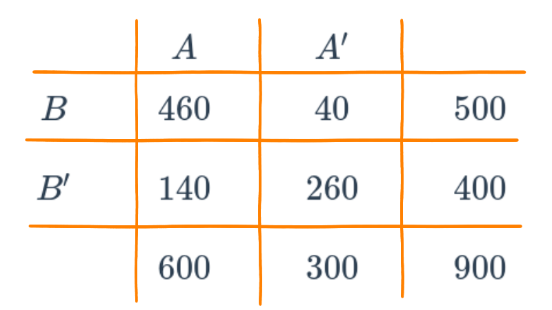
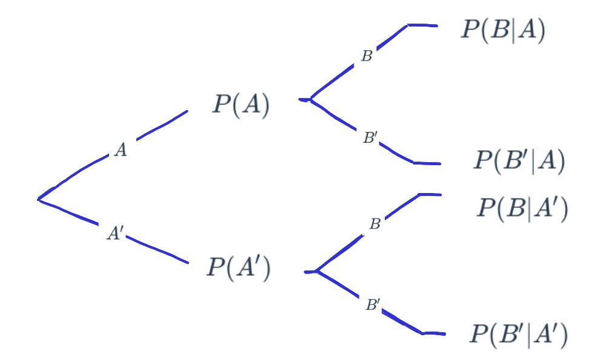
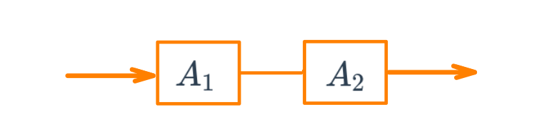
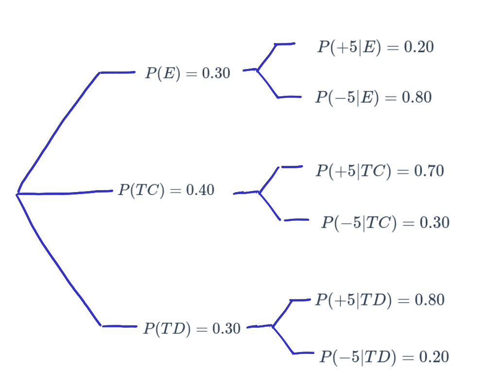

---
title: <span style="color:#235784"> **Probabilidad**</span>  
author: "dgonzalez "
subtitle: <span style="color:#235784">**Módulo 2**</span> 
output:
  html_document:
    toc: no
    toc_depth: 2
    toc_float: yes
    code_folding: hide
    css: style.css
---    

```{r setup, include=FALSE}
knitr::opts_chunk$set(echo = TRUE, message = FALSE, warning = FALSE, comment = NA)
library(psych)
library(summarytools)
library(RColorBrewer)
library(knitr)
library(readxl)
library(tidyverse)


library(summarytools)
library(devtools)
# install_github("lchiffon/wordcloud2")
library(wordcloud)

# install.packages("devtools")
# devtools::install_github("dgonxalex80/paquete018")
library(paquete018)
# 
#install.packages('remotes')  # solo una vez
library(remotes) # solo una vez
data(Colombia23)
library(readr)
futbol <- read_csv("data/futbol.csv")
# colores
c0= "#F7AA00"
c1= "#235784"
c2= "#40A8C4"
c3= "#EEF6F7"

c4= "#11224D"
c5= "#5B84C4"

paleta4=c(c0,c1,c2,c4)

```

<br/><br/>

# **Recursos**

Antes de empezar con el tema reflexionemos sobre los siguientes interrogantes:

#### ¿Qué es la probabilidad?
#### ¿Cuál es su uso.....?
#### ¿Como se mide......?
#### ¿Que tipos de probabilidad existen?
#### ¿Qué propiedades posee....?

<br/><br/>

#### ¿Qué significado tienen las palabras...

##### Azar - Aleatorio
##### Determinístico - No deterministico
##### Incertidumbre - Probable - Improbable
##### Cierto - Incierto - Imposible


```{r, echo=FALSE, warning=FALSE, message=FALSE,  fig.height=8, fig.width=8}
library("tm")
library("SnowballC")
library("wordcloud2")
library("RColorBrewer")
set.seed(1234)
# nube1 <- read.csv("data/nube1.csv")

palabras=c("probabilidad",
           "azar",
           "aleatorio",
           "deterministico",
           "incertidumbre",
           "probable",
           "imposible",
           "cierto",
           "incierto",
           "clásico",
           "subjetivo",
           "frecuentista",
           "evento",
           "experimento",
           "conjunto",
           "unión",
           "interseción",
           "conjunto",
           "marginal",
           "Pascal",
           "Fermat",
           "De Meré",
           "Gauss",
           "Laplace",
           "Kolmogorov",
           "riesgo",
           "decisión") # 27
replicas=c(11,8,8,8,8,8,8,8,8,4,
           4,4,4,4,4,4,4,4,4,6,
           6,6,5,5,5,8,8)

nube1=rep(palabras, replicas)

t=data.frame(table(nube1))

dword=t[,1]
dfreq=t[,2]
#set.seed(1234)
# wordcloud(words = dword, freq = dfreq, min.freq = 1,
#            max.words=200, random.order=FALSE, rot.per=0.35,
#            colors=brewer.pal(8, "Dark2"))

  library(wordcloud2)
  wordcloud2(data = t, size = 0.2, shape = "circle")

```


Muchos relacionamos el concepto de probabilidad con los dados, pues forma parte de su origen y de su desarrollo inicial a través de preguntas y situaciones imaginarias y de alguna forma modelables desde la matemáticas. Pero este concepto va mucho mas alla como lo veremos en esta unidad.

La probabilidad es un concepto que se empieza a trabajar en 1654 cuando, caballero de Mered solicita a B. Pascal le ayude a resolver un problema relacionado con juegos de mesa. En particular este caballero manifestaba que las Matemáticas presentaban un vacio, pues sus cálculos no coincidían con lo que pasaba en la realidad y como consecuencia de ellos perdía dinero en las apuestas que se presentaban en el juego. 

Encomendado Pascal de esta tarea empieza a compartir su trabajo con Fermat, matemático y de la correspondencia de estos dos brillantes matemáticos nace los principios y fundamentos de  lo que hoy conocemos como probabilidad

<br/><br/>


```{r, echo=FALSE, out.width="60%", fig.align = "center"}
knitr::include_graphics("img/pascal.png")
```

Con el fin de motivar la construcción de los conceptos principales del tema se plantean las siguientes situaciones :

<br/>

### **Problema**

El siguiente problema fué planteado por el Caballero de Meré a Pascal quien lo consultó con Fermata y conforma una serie de situaciones que dan origen a soluciones que conforman los inicios del estudio de la Probabilidad (1654).

Los dados, tal y como los conocemos hoy  en día, se hicieron muy populares en la edad media.  En esta época un caballero llamado Chevalier de Mere propuso el siguiente problema: 
 			
Qué es más probable : 

+ Sacar al menos un seis en cuatro tiradas con un solo dado o  

+ Sacar al menos un doble seis en 24 tiradas con dos dados? 

El caballero  afirmaba que este problema generaba una solución matemática que difería de la observación empírica

Este problema se retoma mas adelante

Iniciaremos con algunos conceptos básicos que nos permiten la contribución de sus fundamentos.

[El problema de los dados del caballero de Meré: soluciones publicadas en el siglo XVII](http://materias.df.uba.ar/estadisticaa2019v/files/2019/02/El_caballero_de_Mere.pdf)

<br/><br/>


```{r, echo=FALSE, out.width="60%", fig.align = "center"}
knitr::include_graphics("img/dados.gif")
```


<br/>
<center>
Tomada : película El dorado 
</center>


<br/><br/>

## **Conceptos básicos**

<br/><br/>

<div style="padding: 15px; border: 1px solid transparent; border-color: transparent; margin-bottom: 20px; border-radius: 4px; color: #000000; background-color: #CEE8EE ; border-color: #000000;">

### **Experimento aleatorio** 

Acción que puede ser replicada bajo las  mismas condiciones y cuyo resultado no se conoce por anticipado.

</div>

+ $E_{1}$: Lanzar una moneda dos veces y observar los resultados obtenidos en sus caras superiores 

+ $E_{2}$: Lanzar dos dados y observar la suma de los resultados superiores 

+ $E_{3}$: Realizar un examen de estadística y observar el resultado obtenido  

+ $E_{4}$: En una salida de campo, observo si se cumple o no, totalmente el objetivo planteado 

+ $E_{5}$: Observo el número total de ensayos de laboratorio exitosos en  20 intentos realizados.

<br/><br/>

<div style="padding: 15px; border: 1px solid transparent; border-color: transparent; margin-bottom: 20px; border-radius: 4px; color: #000000; background-color: #CEE8EE ; border-color: #000000;">

**Espacio muestral** 

Conjunto de todos los posibles valores que puede tomar el experimento aleatorio. Este conjunto se nombra conuna letra mayuscula $S$ o tambien con **$\Omega$**
</div>

+ $S_{1}$= $\{ (cc), (cs), (sc), (ss) \}$  
<br/>

:::: {style="display: flex;"}

::: {}

+ $\begin{equation*}
	S_{2}=\left\{
	\begin{array}{cccccc}
	&(1,1),(1,2),(1,3),(1,4),(1,5),(1,6)&\\
	&(2,1),(2,2),(2,3),(2,4),(2,5),(2,6)&\\
	&(3,1),(3,2),(3,3),(3,4),(3,5),(3,6)&\\
	&(4,1),(4,2),(4,3),(4,4),(4,5),(4,6)&\\
	&(5,1),(5,2),(5,3),(5,4),(5,5),(5,6)&\\
	&(6,1),(6,2),(6,3),(6,4),(6,5),(6,6)&
	\end{array}
	\right\}
	\end{equation*}$ 

:::

::: {}

```{r, echo=FALSE, out.width="100%", fig.align = "center"}
knitr::include_graphics("img/dados.png")
```
:::

::::

<br/>

+ $S_{3}$= $\{ x \in \mathbb{R} | 0 \leq x \leq 5   \}$ 

<br/>

+ $S_{4}$= $\{ x \in \mathbb{N}| 0 \leq x \leq 1 \}$ 

<br/>

+ $S_{5}$= $\{ x \in \mathbb{N}| 0 \leq x \leq 20 \}$

<br/><br/><br/>

<div style="padding: 15px; border: 1px solid transparent; border-color: transparent; margin-bottom: 20px; border-radius: 4px; color: #000000; background-color: #CEE8EE ; border-color: #000000;">

### **Evento aleatorio** 

Subconjunto del espacio muestral que es de nuestro interés. Como todo conjunto se nombra con una letra mayúscula por lo general las primeras letras del alfabeto

</div>

|           |                                       |                      |
|:----------|:--------------------------------------|:---------------------|
|$A_{1}$    | Obtener solo caras                    | $A_{1}=\{ (c,c)\}$
| $A_{2}$   | Sacar un resultados es inferior a 4   | $A_{2}=\{(1,1),(1,2)(2,1)\}$
| $A_{3}$   | Ganar el examen                       | $A_{3}=\{ x \in \mathbb{R} | 3.0 \leq x \leq 5.0 \}$
| $A_{4}$   | Cumplir el objetivo de la salida      | $A_{4} =\{ 1 \}$
| $A_{5}$   | Obtener más de 5 ensayos éxitos       | $A_{5}$= $\{ x \in \mathbb{N}| 6 \leq x \leq 20 \}$

<br/><br/>


Resumiendo:

|Experimento aleatorio| Espacio muestral | Evento aleatorio |
|:--------------------|:-----------------|:-----------------|
|Lanzar una moneda dos veces y observar los resultados obtenidos en sus caras superiores| $S_{1}$= $\{ (cc), (cs), (sc), (ss) \}$ | Obtiener solo caras |
|Lanzar dos dados y observar la suma de los resultados superiores| $S_{2}$= $\{(1,1),(1,2), \dots, (6,6) \}$ | Sacar un resultados es inferior a 6 |
|Realizar un examen de estadística y observar el resultado obtenido|  $S_{3}$= $\{ x \in \mathbb{R} | 0 \leq x \leq 5 \}$| Ganar el examen|
|En una salida de campo, observo si se cumple o no, totalmente el objetivo planteado| $S_{4}$= $\{ x \in \mathbb{N}| 0 \leq x \leq 1 \}$| Cumplir el objetivo de la salida |
|Observo el número total de ensayos de laboratorio exitosos en  20 intentos realizados| $S_{5}$= $\{ x \in \mathbb{N}| 0 \leq x \leq 20 \}$| Obtener más de 5 ensayos éxitos |

<br/><br/><br/>

## **Enfoques de probabilidad**

<br/><br/><br/>

<div style="padding: 15px; border: 1px solid transparent; border-color: transparent; margin-bottom: 20px; border-radius: 4px; color: #000000; background-color: #CEE8EE ; border-color: #000000;">

### **Enfoque clásico**  

Es el enfoque más antiguo de probabilidad y que está basado en el supuesto de eventos individuales igualmente probables. La probabilidad bajo ese enfoque para el evento $A$ se calcula como la fracción entre el número de elementos del conjunto $A$, $n(A)$ y el número de elementos del espacio muestral $n(S)$: 
		
$$P(A)=\dfrac{n(A)}{n(S)}$$

</div>
	
En el caso del evento $A_{1}=\{(c,c)\}$, su probabilidad se obtiene como: 

$P(A_{1}=\dfrac{n(A_{1})}{n(S_{1})}=\dfrac{1}{4}=0.25$ 

Para $A_{2}$, la suma de los resultados es inferior a 6, se obtiene de la siguiente forma

$P(A_{2})=\dfrac{n(A_{2})}{n(S_{2})}=\dfrac{9}{36}=0.25$

<br/><br/> 


En la gran mayoria de casos no se cumplen los supuestos anteriores, pues se tienen eventos que no son igualmente probables, lo cual impide que podamos utilizar el enfoque frecuentista. 

Ahora suponemos que lo ocurrió en el pasado segirá pasando y asi estudiando la información recogida podemos predecir la posibilidad de ocurrencia de un evento futuro

<br/><br/><br/>

<div style="padding: 15px; border: 1px solid transparent; border-color: transparent; margin-bottom: 20px; border-radius: 4px; color: #000000; background-color: #CEE8EE; border-color: #000000;">

### **Enfoque Frecuentista**

Este enfoque basa su cálculo en la frecuencia con que ocurre un evento en un tamaño de muestra determinado $n$.

			
$$\lim_{n \to{+}\infty} P(A)=\Bigg[ \dfrac{\text{número de veces que ocurre A}}{n} \Bigg]$$

</div>

<br/><br/>

### **EJEMPLO**

```{r, echo=FALSE, out.width="100%", fig.align = "center"}
knitr::include_graphics("img/penalti.gif")
```

<br/><br/>

Si observamos el cobro de un penalti en un partido de fútbol, el cobrador tiene un gran número de posibilidades (lugares) para colocar el balón que podemos simplificar en 6 : parte baja derecha, parte alta derecha, parte baja al centro, parte alta central, parte baja izquierda y parte alta izquierda. Por su parte el arquero piensa también es estos lograres para evitar que el disparo termine en gol. Hoy en dia ambos jugadores estudian las frecuencias para determinar cual lugar ofrece mayores probabilidades de obtener éxito desde su rol.

<br/>

Para calcular la probabilidad de que un jugador ejecute y convierta gol, debemos utilizar el enfoque frecuentista, contando para ello información pasada y realizando una división entre el numero de aciertos sobre el numero total de cobros.

<br/>

### **EJEMPLO**

Otro ejemplo puede estar relacionado con la probabilidad de muerte por Covid en Colombia. Es de aclarar que esta probabilidad no se mantiene constante a través del tiempo pues los efectos causados por la vacunación y su evolución hacen que esta probabilidad cambie. Por fines prácticos tomaremos una muestra del total de colombianos infectados desde  como denominador y como numerador el numero total de muertos

```{r, eval=FALSE}
Colombia=readRDS("data/Colombia23.RDS")
tabla=summarytools::freq(Colombia$ubicacion, cumul = FALSE)
tabla
```

Con base en esta tabla podríamos pensar que la probabilidad de que una persona muera a causa del Covid-19 es del `0.0289`. Valor que se obtiene al dividir el número de personas fallecidas y el número total de personas que se han contraído covid. Claro bajo el supuesto de que todos las personas tenemos la misma probabilidad de fallecer. Hecho que se discutirá mas adelante.

<br/><br/><br/>

<div style="padding: 15px; border: 1px solid transparent; border-color: transparent; margin-bottom: 20px; border-radius: 4px; color: #000000; background-color: #CEE8EE ; border-color: #000000;">

### **Enfoque subjetivo** 

En este caso la probabilidad es valorada y asignada por un **EXPERTO**, como un médico, un ingeniero, un abogado, un economista, un biólogo, un estadístico ......

</div>

<br/><br/><br/>

## **Axiomas de  probabilidad**

<div style="padding: 15px; border: 1px solid transparent; border-color: transparent; margin-bottom: 20px; border-radius: 4px; color: #000000; background-color: #CEE8EE ; border-color: #000000;">

+ $A_{1}$ : Sea $S$ un espacio muestral  asociado a un experimento. Entonces:

$$P(S)=1$$ 

+ $A_{2}$ : Para cualquier evento $A$, se cumple que:

$$0 \leq P(A) \leq 1$$ 

+ $A_{3}$ : Si $A$ y $B$ son dos eventos mutuamente excluyentes, entonces: 
$$P(A \cup B) = P(A) + P(B)$$ 
En general 

$$P(A \cup B) = P(A)+ P(B) - P(A \cap B)$$ 


+ $A_{4}$ : Para cualquier evento $A$, $P(A')=1-P(A)$

+ $A_{5}$ : La probabilidad que no ocurra nada : 

$$P(\phi) = 0$$   

</div>

<br/><br/><br/>

## **Tipos de probabilidad**

<br/><br/>

:::: {style="display: flex;"}
::: {}

```{r, echo=FALSE, out.width="70%", fig.align = "center"}
knitr::include_graphics("img/tabla1_22.png")
```
  
:::
::: {}

```{r, echo=FALSE, out.width="70%", fig.align = "center"}
knitr::include_graphics("img/diagrama5_22.png")
```
:::
  
::::


<br/><br/>

### **Probabilidad simple o marginal**
			
+ $P(A)$ : probabilidad de que ocurra A 

+ $P(A')$ : probabilidad de que NO ocurra A 

+ $P(B)$ : probabilidad de que ocurra B 

+ $P(B')$ : probabilidad de que NO ocurra B 
			
<br/><br/><br/>

### **Probabilidad conjunta** 
			
+ $P(A \cap B)$ : probabilidad de que ocurra A y B 
			
+ $P(A' \cap B)$ : probabilidad de que NO ocurra A y ocurra B 

+ $P(A \cap B')$ : probabilidad de que ocurra A y NO ocurra B 

+ $P(A' \cap B')$ : probabilidad de que NO ocurra A ni B 


<br/><br/><br/>

## **Probabilidad condicional**

<div style="padding: 15px; border: 1px solid transparent; border-color: transparent; margin-bottom: 20px; border-radius: 4px; color: #000000; background-color: #CEE8EE; border-color: #000000;">

### **Definición** 
### **Probabilidad condicional**

La probabilidad condicional de $B$, dado $A$, se denota como $P(B|A)$, se define como:

$$P(B|A)=\dfrac{P(A \cap B)}{P(A)}$$

Siempre que $P(A) > 0$

</div>

<br/>

$P(B|A)$ se puede leer como :

+ Probabilidad de que ocurra $B$ dado que el evento $A$ ya ocurrió

+ Probabilidad de que ocurra $B$ sabiendo previamente que ocurrió el evento $A$

+ Si sabemos que ha ocurrido el evento $A$, la probabilidad de que ocurra $B$

<br/><br/>

El efecto de conocer la ocurrencia del evento $A$ hace que el espacio muestral de referencia pase de ser $S$ a solo $A$.  Ahora dentro de este nuevo espacio muestal de referencia se debe establecer la probabilidad de que ocurra $B$

De esta manera la probabilidad se expresa como la razón entre la probabilidad conjunta 
$P(A \cap B)$ con la probabilidad de $A$

<br/><br/><br/>

##  **EJEMPLO**</span> 

Supongamos que se tiene la siguiente información escrita en una tabla de doble entrada o tabla cruzada que contiene dos eventos $A$ y $B$ :

```{r}
x=c(460,140,40,260)
m=matrix(x,nrow = 2) 
rownames(m) = c("B", "B*")
colnames(m) = c("A", "A*")
m
```

En la siguiente tabla se representan los tres tipos de probabilidad :
<br/>

:::: {style="display: flex;"}
::: {}

```{r, echo=FALSE, out.width="80%", fig.align = "center"}

```
  
:::
::: {}

```{r, echo=FALSE, out.width="80%", fig.align = "center"}
knitr::include_graphics("img/tabla4_22.png")
```
:::
  
::::


<br/><br/><br/>


Esta información tambien se puede representar como un diagrama de árbol 

<br/>

```{r, echo=FALSE, out.width="50%", fig.align = "center"}

```
<br/><br/>

O también como un diagrama de Venn:

<br/>

```{r, echo=FALSE, out.width="50%", fig.align = "center"}
knitr::include_graphics("img/diagrama5_22.png")
```

<br/><br/>


Por despeje se pueden obtener la llanada regla de la multiplicación :

<br/><br/>

<div style="padding: 15px; border: 1px solid transparent; border-color: transparent; margin-bottom: 20px; border-radius: 4px; color: #000000; background-color: #CEE8EE ; border-color: #000000;">

### **Definición**: 
### **Regla de la multiplicación de eventos**

La probabilidad de que ocurra A y B asociados a un experimento aleatorio es :

$P(A \cap B) = P(A) P(B|A)$  o  $P(A \cap B) = P(B) P(A|B)$

En el caso de los eventos A y B sean independientes entonces :

$$P(A \cap B) = P(A) P(B)$$

</div>


<br/><br/><br/>

## **Eventos independientes**

En el caso que se requiera evaluar si dos eventos son independientes o no, partiendo de la definición de probabilidad condicional se podría obtener la siguiente regla al despejar $P(A \cap B$ de la ecuación para obtener : $P(A \cap B) = P(A) * P(B|A)$. En caso de que la ocurrencia del evento $A$ previamente al evento $B$, no cambie su probabilidad, se podría escribir que $P(B|A)= P(B)$ y en este caso la regla indica que la probablidad conjunta de los eventos A y B es igual a la probabilidad de sus probabilidades marginales :

<br/><br/>

<div style="padding: 15px; border: 1px solid transparent; border-color: transparent; margin-bottom: 20px; border-radius: 4px; color: #000000; background-color: #CEE8EE ; border-color: #000000;">

### **Definición**: 
### **Independencia de eventos**

Dos eventos A y B son independientes si y solo si la probabiliad del evento B no es afectada por la ocurrencia del evento A o viceversa.

$P(A \cap B) = P(A) P(B)$ o  $P(B|A)=P(B)$

</div>

<br/><br/><br/>

:::: {style="display: flex;"}
::: {}

Para determinar si los eventos A y B son eventos independientes se debe cumplir que :

$$P(A \cap B) = P(A) P(B)$$ 
$$P(A \cap B') = P(A) P(B')$$ 
$$P(A' \cap B) = P(A') P(B)$$ 
$$P(A' \cap B') = P(A') P(B')$$ 

:::
:::{} 

```{r, echo=FALSE, out.width="70%", fig.align = "center"}
knitr::include_graphics("img/tabla1_22.png")
```


:::
::::


En el caso que se cumplan todas las condiciones, diremos que los eventos son independientes. En caso contrario,  los eventos no son independientes

<br/><br/>

Una aplicación de este concepto se ilustra con los siguientes ejemplos:

<br/><br/>

### **EJEMPLO**

Se tiene un circuito formado por dos componentes $A_{1}$ y $A_{2}$ cada uno con probabilidad de funcionamiento $P(A_{1}) = 0.90$  y $P(A_{2}) = 0.95$ . Determinar la probabilidad de que el componente funcione.


```{r, echo=FALSE, out.width="40%", fig.align = "center"}

```

<br/><br/>

**Solución:**

Inicialmente se supone que los componentes $A_{1}$ y $A_{2}$ funcionan de manera independiente. Esto implica que $P(A_{1} \cap A_{2}) = P(A_{1}) P(A_{2})$

Como para que el circuito funcione debe funcionar el componente $A_{1}$ y $A_{2}$, utilizando el principio de independencia tenemos que:

$$P(A_{1} \cap A_{2}) = P(A_{1}) P(A_{2}) = 0.90 \times  0.95 = 0.855$$


<br/><br/><br/>

### **EJEMPLO**

Ahora supongamos que el circuito anterior está conectado en paralelo. Determinar la probabilidad de que el circuito funciones

```{r, echo=FALSE, out.width="40%", fig.align = "center"}
knitr::include_graphics("img/circuito2.png")
```

<br/><br/>

**Solución:**

En este caso solo hay una manera como el circuito no funciona y es cuando ambos componentes no funcionan. Esto implica que la probabilidad de que no funcione bajo el supuesto que los dos componentes son independientes es:

$$P(A_{1}^{'} \cap A_{2}^{'}) = P(A_{1}^{'}) \times P(A_{2}^{'}) = 0.10 \times 0.05 = 0.005 $$

Ahora como se requiere la probabilidad de que el circuito funciones se utiliza el axiona  $A_{4}$ : Para cualquier evento $A$, $P(A')=1-P(A)$


$$1-0.005 = 0.995$$


<br/><br/><br/>

### **EJEMPLO**

El departamento de crédito de la universidad, informa que el 30% de los pagos realizados en la universidad se efectúan en efectivo, un 40% con tarjeta de crédito y el resto con tarjeta débito. En todos los casos estos pagos solo son recibidos en la caja ubicada en la oficina de Registro Académico de la universidad.

Tambien se conoce que 20% de los pagos realizados en efectivo, 70% de los pagos realizados con tarjeta de crédito y el 80% de los pagos realizados con tarjeta débito, corresponden a pagos por valores superiores a $500 mil pesos

Con el fin de mejorar el servicio, se esta diseñando un sistema de turnos que agilice el procedimiento de atención . El ingeniero a cargo del diseño de sistema requiere le ayude a valorar las prioridades para las personas que deben pagar mas de $500 mil pesos, pues el ingeniero sospecha que es más probable que una persona requiere pagar más de $500 mil pesos,  lo haga con efectivo.  Ayude al ingeniero con la información necesaria que le permita reafirmar su sospecha o por el contrario a valorar las diferentes posibilidades

<br/><br/>

**Solución:**

<br/>

Definimos los siguientes eventos :

+ **E**  : El pago se realiza en efectivo
+ **TC** : El pago se realiza con tarjeta de crédito
+ **TD** : El pago se realiza con tarjeta débito
+ **+5** : El pago es por una cantidad superior a $500 mil pesos

<br/>

**Información :**

|                        |                        | por diferencia      |
|:-----------------------|:-----------------------|:--------------------|
|$P(E) = 0.30$           | $P(+5 | E) = 0.20$     |  $P(-5 | E) = 0.80$ | 
|$P(TC) = 0.40$          | $P(+5 | TC) = 0.70$    | $P(-5 | TC) = 0.30$ | 
|$P(TD) = 0.30$          | $P(+5 | TD) = 0.80$    | $P(-5 | TD) = 0.20$ |


<br/><br/>

```{r, echo=FALSE, out.width="50%", fig.align = "center"}

```

<br/>

|                                                            |                            |
|:-----------------------------------------------------------|:---------------------------|
|$P(E|+5) = \dfrac{P(E \cap +5)}{P(+5)} = \dfrac{0.06}{0.58} = 0.1034$ | **TERCERO**      |
|                                                                      |                  |    
|$P(TC | +5)  =  \dfrac{P(TC \cap +5)}{P(+5)} = \dfrac{0.28}{0.58} = 0.4827$ | **PRIMERO**|
|                                                                            |            |                                
|$P(TD | +5)  =  \dfrac{P(TD \cap +5)}{P(+5)} = \dfrac{0.24}{0.58} = 0.4138$ | **SEGUNDO**|

<br/><br/><br/>


##  **Probabilidad Total**


Ahora supongamos que el espacio muestral esta formado por un conjunto de eventos lo podemos representar como una partición del conjunto $S$ así :

```{r, echo=FALSE, out.width="50%", fig.align = "center"}
knitr::include_graphics("img/particion1_22.png")
```

<br/><br/>


###  **Nota** 

 Una partición de un conjunto de $S$ está formada por subconjuntos $A_{1}$, $A_{2}$, $\dots$ , $A_{n}$, que deben cumplir las siguiente propiedades :

+ $A_{1} \cup A_{2} \cup \dots \cup A_{n}=S$

+ $A_{i} \cap A_{j} = \phi$ , para todo $i \neq j$
 
+ $A_{i} \neq \phi$ 
 
 <br/><br/>

 En nuestro caso podemos tener solo cinco particiones para simplificar el procedimiento

 <br/>
 
```{r, echo=FALSE, out.width="50%", fig.align = "center"}
knitr::include_graphics("img/particion2_22.png")
```

 <br/><br/>
 
 Pdemos reasaltar los conjuntos que conforman a $B$ :
 
```{r, echo=FALSE, out.width="50%", fig.align = "center"}
knitr::include_graphics("img/particion3_22.png")
```
 
 <br/><br/>
 
 Tambien podemos recostruir $B$ como :
 
 $B = (A_{1} \cap B) \cup (A_{2} \cap B) \cup (A_{3} \cap B) \cup (A_{4} \cap B) \cup (A_{5} \cap B)$
 
<br/><br/>

En terminos de probabilidad  tenemos
  
$P(B) = P(A_{1} \cap B) + P(A_{2} \cap B) + P(A_{3} \cap B) + P(A_{4} \cap B) + P(A_{5} \cap B)$

Este resultado se puede expresar en otros terminos de la regla de la multiplicacion:

$P(B) = P(A_{1})P(B|A_{1}) + P(A_{2})P(B|A_{2})  +P(A_{3})P(B|A_{})  + P(A_{4})P(B|A_{4}) + P(A_{5})P(B|A_{5})$

<br/><br/>

En general :
   
<br/><br/><br/>  

<div style="padding: 15px; border: 1px solid transparent; border-color: transparent; margin-bottom: 20px; border-radius: 4px; color: #000000; background-color: #CEE8EE; border-color: #000000;">

### **Definición**:
### **Regla de la probabilidad total**

Dado una serie de eventos que conforman una partición $E_{1}$, $E_{2}$, $E_{3}$, $\dots$, $E_{k}$, que son mutuamente excluyentes y exaustivos y un evento A, la probabilidad del evento A se expresa como :

$$P(A)=P(E_{1})P(A|E_{1})+ P(E_{2})P(A|E_{2})+ P(E_{3})P(A|E_{3})+ \dots P(E_{k})P(A|E_{k})$$

</div>


<br/><br/><br/>

### **EJEMPLO**

En el caso que en el ejemplo anterior se requiere calcular la probabilidad $P(+5)$ utilizamos la regla de la probabilidad total:


$P(+5) = P(E)P(+5|E) + P(TC)P(+5|TC)  +P(TD)P(+5|TD)$

$P(+5) = P(E)P(+5|E) + P(TC)P(+5|TC)  +P(TD)P(+5|TD)$

$P(+5) = 0.30 \times 0.20 + 0.40 \times 0.70 + 0.30 \times 0.80$

$P(+5) = 0.06 + 0.28 +0.24 = 0.58$

<br/><br/><br/> 

##  **Teorema de Bayes**

<br/><br/>


```{r, echo=FALSE, out.width="40%", fig.align = "center"}
knitr::include_graphics("img/Thomas_Bayes.gif")
```

<br/>

**Thomas Bayes** (Londres, Inglaterra, ~1702 - Tunbridge Wells, 1761) fue un matemático británico y ministro presbiteriano. Su obra más conocida es el Teorema de Bayes.

<br/><br/> 

El teorema de Bayes, que lleva el nombre del matemático británico del siglo XVIII **Thomas Bayes**, es una fórmula matemática para determinar la probabilidad condicional . La probabilidad condicional es la probabilidad de que ocurra un resultado, basada en un resultado previo. El teorema de Bayes proporciona una forma de revisar las predicciones o teorías existentes (actualizar las probabilidades) dada la evidencia nueva o adicional. En finanzas, el teorema de Bayes se puede utilizar para calificar el riesgo de prestar dinero a posibles prestatarios.

Tomado de  : https://www.investopedia.com/terms/b/bayes-theorem.asp <br/> 
Lectura recomendada : https://blogs.scientificamerican.com/cross-check/bayes-s-theorem-what-s-the-big-deal/


<br/><br/><br/> 

<div style="padding: 15px; border: 1px solid transparent; border-color: transparent; margin-bottom: 20px; border-radius: 4px; color: #000000; background-color: #CEE8EE ; border-color: #000000;">

### **Definición**:
### **Teorema de Bayes**

Dado una serie de eventos que conforma una partición $E_{1}$, $E_{2}$, $E_{3}$, $\dots$, $E_{k}$ , que son mutuamente excluyentes y exhautivos, con probabilidad a priori $P(E_{1})$, $P(E_{2})$ $P(E_{3})$, $\dots$, $P(E_{k})$. Si ocurre un evento $A$, la probabilidad a posteriori de $E_{i}$ dados $A$, es la probabilidad condicional :

$$P(E_{i}|A)=\dfrac{P(E_{i} \cap A)}{P(A)}= \dfrac{P(E_{i}) P(A|E_{i})}{\displaystyle\sum_{j=1}^{k} P(E_{j})P(A|E_{j})} $$

</div>

<br/><br/><br/>

### **EJEMPLO**

<br/>

Continuando con el ejemplo anterior puede ser necesario calcular la probabilidad : $P(E|+5)$ para lo cual utilizamos el Teorema de Bayes


$P(E|+5) = \dfrac{P(E \cap +5)}{P(+5)} = \dfrac{P(E)P(+5|E)}{P(E)P(+5|E) + P(TC)P(+5|TC)  +P(TD)P(+5|TD)}$

$P(E|+5) = \dfrac{0.30 \times 0.20}{0.30 \times 0.20 + 0.40 \times 0.70 + 0.30 \times 0.80} = \dfrac{0.06}{0.58} = 0.1034$

<br/><br/>

### **EJEMPLO**

En una fábrica de artı́culos para protección biodegradables, cuatro operarios colocan etiquetas de caducidad en cada
artı́culo al final de la lı́nea de producción. Juan, quien coloca la fecha de caducidad en un 40 % de los paquetes no
logra ponerla en uno de cada 200 paquetes; Luis, quien coloca en 30 % de los paquetes, no logra colocarla en uno
de 100 paquetes; Maria, quien coloca etiquetas en el 15 % de los paquetes, no lo hace una vez en 90 paquetes; y Santiago que fecha 15 % de los paquetes, falla en uno de cada  200 paquetes. Si un cliente se queja de que su paquete no
muestra la fecha de caducidad. ¿Cuál de los empleados es el más probable culpable de esta omisión?

Solución:

Información

| Juan              | Luis                     |  Maria                     |  Santiago                     |
|:------------------|:-------------------------|:---------------------------|:------------------------------|
|$P(J) =  0.40$     | $P(L) =0.30$              | $P(M)=0.15$                | $P(S)=0.15$                   |
|                   |                          |                            |                               |
|$P(N|J)=1/200$     |$P(N|L) = 1/100$          |$P(N|M)=1/90$               |$P(N|S)=1/200$                 |

<br/>

En terninos de conjuntos podemos escribir:

$$N = (J \cap N) \cup (L \cap N) \cup (M \cap N) \cup (S \cap N) $$
<br/><br/>

Ahora en terminos de probabilidad:


$$P(N) = P(J \cap N) + P(L \cap N) + P(M \cap N) + P(S \cap N) $$
$$P(N) = P(J)P(N|J) + P(L)P(N|L) + P(M)P(N|M) + P(S)P(N|S)$$
$$P(N) = 0.40 \dfrac{1}{200} + 0.30 \dfrac{1}{100} + 0.15 \dfrac{1}{90} + 0.15 \dfrac{1}{200} = 0.007416667$$

Por tanto:

$$P(J|N) = \dfrac{0.00200}{0.00200 + 0.00300 + 0.00167 + 0.00075} = 0.2696629 $$
$$P(L|N) = \dfrac{0.00300}{0.00200 + 0.00300 + 0.00167 + 0.00075} = 0.4044944$$
$$P(M|N) = \dfrac{0.00167}{0.00200 + 0.00300 + 0.00167 + 0.00075} = 0.2247191$$
$$P(S|N) = \dfrac{0.00075}{0.00200 + 0.00300 + 0.00167 + 0.00075} = 0.1011236$$

```{r}
x=c(0.4,0.3,0.15,0.15)
y=c(1/200,1/100,1/90,1/200)
(x*y)/sum(x*y)
```

Por los resultados anteriores el obrero más probable de haber cometido el error es LUIS, con una probabilidad de 0.404


<br/><br/><br/>


Aplicaciones :

## **Árboles de decisión**

<br/>

```{r}
#  install.packages("titanic")  # instalar paquete titatic
library(titanic) #  cargar paquete
data(titanic_train)  # cargar los datos

# install.packages("rpart")
# install.packages("rattle")
#install.packages("rpart.plot")

library(rpart)
library(rattle)
library(rpart.plot)

arbol=rpart( formula = Survived ~ Sex,
             data = titanic_train,
             method = "class")
fancyRpartPlot(arbol)
```
<br/>
Código basado en: https://www.youtube.com/watch?v=t0lmtrm_aa0

<br/><br/>

**Resultados del árbol**

<br/>

**Eventos** : 

+ $S$ : sobrevive
+ $S'$ : no sobrevive
+ $H$ : hombre
+ $M$ : mujer

<br/><br/>

**Probabilidades:**

+ $P(S') = 0.62$
+ $P(S) = 0.28$
+ $P(M) = 0.35$
+ $P(H) = 0.64$
+ $P(S'|M=  = 0.26$
+ $P(S|M=  = 0.74$
+ $P(S'|H) = 0.81$
+ $P(S|H) = 0.19$

<br/><br/>

```{r}
t= table(titanic_train$Survived,
         titanic_train$Sex)       # construcción tabla cruzada

t = t %>%  
      prop.table() %>% 
      addmargins() %>% 
      round(.,4)

rownames(t)=c("Died","Survived", "Sum")

      
t        # tabla de probabilidades
```


<br/>

**Referencias sobre árboles de decisión **

+ https://rpubs.com/jboscomendoza/arboles_decision_clasificacion

+ https://bookdown.org/content/2031/arboles-de-decision-parte-ii.html

<br/><br/><br/>


